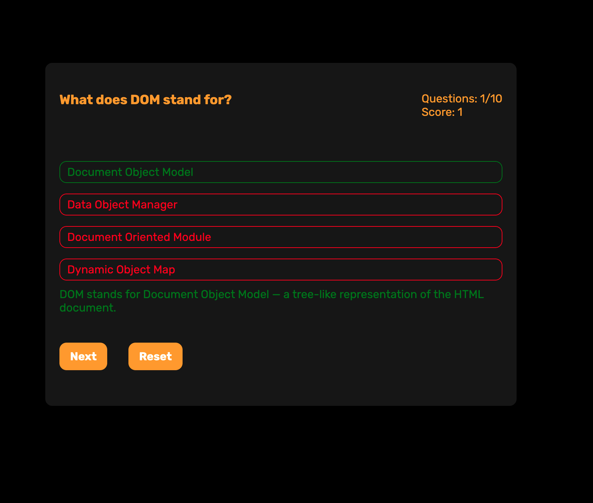
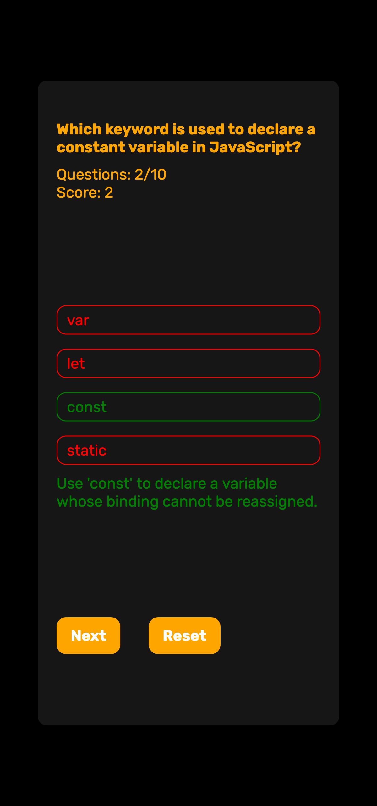

# JavaScript Quiz App

A small vanilla JavaScript quiz app that tests basic JS and frontend knowledge.  
Built without frameworks – just HTML, CSS and modern ES modules.

## Features

- 🎯 Multiple choice questions (JS / frontend basics)
- ✅ One correct answer per question
- 📊 Score tracking
- 🔢 Question counter (`current / total`)
- 💡 Explanation shown after answering
- 🚫 Prevents changing the answer after first click
- ⏭️ “Next” button to move through questions
- 🔁 “Reset” button to restart the quiz
- 📱 Simple responsive layout (optimized for small screens, `max-width: 500px`)

## ScreenShots



## Tech Stack

- HTML5
- CSS3 (flexbox, simple responsive styles)
- Vanilla JavaScript (ES modules)

## Project Structure

```text
.
├── index.html          # Main page
├── index.js            # Quiz logic (render, events, score, navigation)
├── db.js               # Questions data
└── css
    ├── reset.css       # Base reset
    └── style.css       # Styles for quiz layout and components
